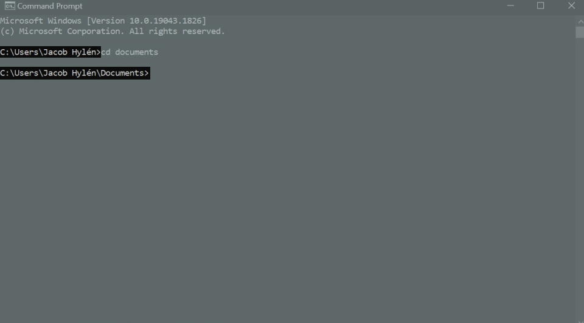
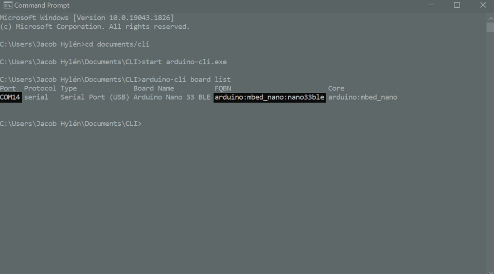
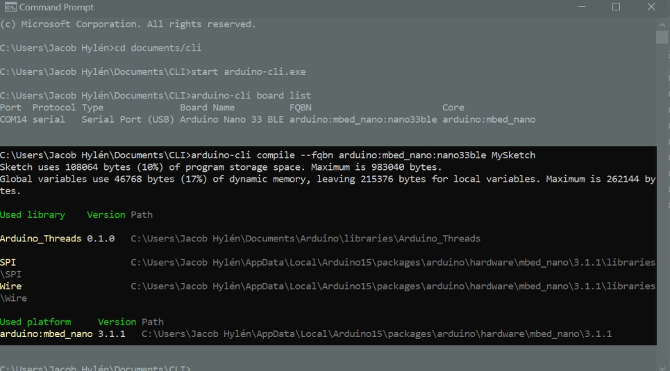
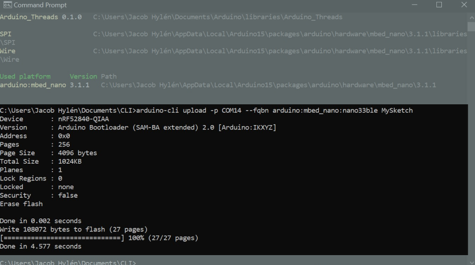

How to get started with the `Arduino CLI` and `Arduino_Threads`
===============================================================
## Introduction
For now, you need to use the Arduino CLI to upload sketches made with the `Arduino_Threads` library. It can be intimidating at first, but once you get the hang of it, it is not that different from working in the IDE. 

This document will help you get started, showing you how to find all the information you need to get off the ground without needing to go in depth and learn everything there is to know about the CLI. 

## Installing 
To use the `Arduino_Threads` library, a special version of the Arduino CLI needs to be downloaded and installed. Installing the Arduino CLI is really just as simple as downloading it and extracting the files from the .zip archive, once it is on your computer it is installed. However, to keep your workflow tidy and organized, we recommend moving it to a directory with a short path. If you have been using the Arduino IDE, most likely the files are stored in your `Documents` folder, so let's put the CLI files in the same place. 

Make a new folder in your `Documents` folder, and name it `CLI`, extract the files from the .zip archive to this folder. 

## Navigating With the Command Prompt and Launching the Arduino CLI
Since the Arduino CLI is a command line tool, it is not a program that you can launch by double clicking on the `.exe` file. Instead, we need to start it from the command prompt. Using the command prompt can be thought of like using the file explorer, you are in a folder, can move around to other folders, create new files, delete files, etc. The difference is that you do all of these things with commands instead of buttons. 

Unlike the file explorer where you click the folder you want to go to, navigating in the command prompt is done by first writing the command letting the program know that we want to move somewhere new, then telling it where we want to go. 

When you open up a command prompt window, you should be started in the root directory of your user profile, you can see in what folder you are by looking at the path text right where you enter your commands. Because you're started at the root of your user profile, the path should say `C:\Users\<your name>`

Inside of this root folder there are other folders, if you want to go into the `Documents` folder, instead of clicking on it like you would do in the file explorer, you write the command: 
```
cd Documents
```
and press enter. Notice how, after executing this command, the path updates to include the folder name of the folder you just went inside of. This part is super important, and it is also where many make small mistakes that keep anything from working the way it should, but if you pay close attention to what folder you are inside of, you can avoid these mistakes.



If you want to go back one step, to the folder you came from, you write this command:

```
cd ..
```
But we don't need to do that now, we want to be inside of the `CLI` folder, that is inside of the `Documents` folder. 

Navigate to it with the command:
```
cd Documents/CLI
```

Once inside of `CLI`, you're ready to launch the Arduino CLI. Launching it this way, ensures that you are launching the special version of the CLI that can handle the `Arduino_Threads` library. Execute this command:
```
start arduino-cli.exe
```

If it seems like nothing happened - great! Then it probably worked. If you got an error, such as a message saying the file could not be found, a few things to check are:

- That you are in the right path, if you've copied the setup suggested in this guide, the directory you want to be in should have the path `C:\Users\<your name>\Documents\CLI`
- That the arduino-cli.exe file is inside of this folder
- That there aren't any small spelling-errors

Once you believe that you have successfully started the Arduino CLI, confirm by executing the command
```
arduino-cli
```
If you get a list of all the available commands, everything is as it should, and you can move on to the next step.

## Finding Information About your Board
To compile sketches and to upload to your Arduino board, you need to know some information about the board you have connected. In this step we're going to find all the information we need. Connect your Arduino board to your computer, and execute the command:
```
arduino-cli board list
```
If your board was found, you will get a bunch of information about it. The information we're interested in is the `FQBN`, and the port. `FQBN` stands for "Fully Qualified Board Name", and is how the computer refers to the board. The port is like an address for the board. 



If you are, like we are, using an Arduino Nano 33 BLE Sense, the `FQBN` will be `arduino:mbed_nano:nano33ble`. We need to specify every time we are compiling and uploading sketches that they are to be compiled for this board, just like we do in the IDE. 

## Installing Cores
If you have already used your Arduino board with the IDE, you can skip this step entirely. Otherwise, there are some files you may need to install to be able to use the board. But don't worry, it's just one command. The Arduino Nano 33 BLE Sense uses the `arduino:mbed_nano` core, which is another piece of information that we got from the board list command we executed, so we need to install that before using the board.

If you are unsure whether or not you have the core installed, go through with this step. If it is already installed, it won't do any harm to do it again.

To install the core, execute this command:
```
arduino-cli core install arduino:mbed_nano
```
If you are using a board with another core, replace `arduino:mbed_nano` in the command with whatever core you got from the board list.

## Make a Sketch
Now it is time to either make a new sketch, or to place a sketch that you have already made or want to test in the `CLI` folder. 

If you want to make a new sketch, use the command:
```
arduino-cli sketch new MySketch
```
and a new folder will be created inside of the `CLI` folder, this new folder is named `MySketch` and contains a file named `MySketch.ino`. This .ino file can be opened, and edited in your text-editor of choice. Once you are happy with the sketch, move on to the next step.

If you already have a sketch that you want to upload, find it and move it into the `CLI` folder. Be sure to move the folder containing the `.ino` file and any extra files included in the sketch, and not the `.ino` file on its own. 

## Compile and Upload

The final steps to do are to compile and to upload the sketch. We'll do this with two separate commands. To compile, we need to pass the FQBN in the command to specify what board we want to compile it for, and we need to tell it what sketch we want to compile. We'll compile the sketch we created earlier to be uploaded to an Arduino Nano 33 BLE Sense. We can do this with the command:
```
arduino-cli compile --fqbn arduino:mbed_nano:nano33ble MySketch 
``` 
Once you execute this command, it's going to start compiling unless something went wrong. If it looks like nothing is happening - Great! That probably means that everything is going as it should. Depending on the core, compiling might take a few minutes. Be patient, it may seem like it's taking too long, but give it time. Eventually, you'll get a statement about the memory use, libraries included, and platform used. 



Now that the sketch is compiled, let's upload it! For this, we need to specify the FQBN again, as well as the port the board is connected to, so it's uploaded to the right place. To find the port, go back to the board list we got earlier, ours is connected to port `COM14`, but replace this part of the command with whatever port your list says. Now execute the command:
```
arduino-cli upload -p COM14 --fqbn arduino:mbed_nano:nano33ble MySketch
```
If everything went as it should, the sketch is now uploading to the board, and once that is done, you've successfully used the Arduino CLI to upload a sketch to your board. 



Now that you know how to do this, it might be a good opportunity to take the deep dive in the DIY-spirit, experiment with different workflows and interfaces for the terminal to tailor your Arduino experience to your liking.