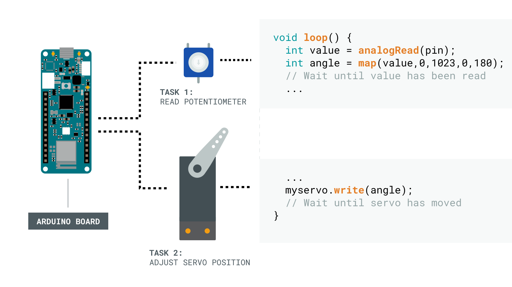

Threading Basics
================
## Introduction
Threading is a concept that is used on many operating systems to run tasks in parallel. An Arduino example of two such tasks could be to read the position of a potentiometer knob while controlling a servo motor to follow that position. Running such tasks in parallel is also called multitasking. 

Previously Arduino sketches didn't support the concept of multitasking, unless you took specific measures to support it. With this so called single-threaded approach instructions in your Arduino sketch are executed sequentially one by one. If an instruction or a function call respectively makes the runtime environment wait for its execution to complete, it's called a "blocking" function. You may have encountered the limitations of this when interacting with multiple sensors and actuators at once. For example if you let a servo motor react to the data read from a potentiometer as mentioned above. While the servo motor is moving to its target position no further reading of the potentiometer can be done because the program waits until the servo is done moving. To solve this issue multitasking can be used which allows to "simultaneously" execute multiple task such as reading from a sensor and controlling a motor. In the context of multitasking a thread is basically a mechanism (provided usually by the operating system) to encapsulate a task to be run concurrently with others.



In the historic single-threaded execution of Arduino sketches the complete program logic is contained within the `*.ino` file. It contains both a `setup()` function, which is executed only once at program start, and a `loop()` function, which is executed indefinitely. A single-threaded Arduino project can theoretically contain multiple `*.ino` files but you can define `setup()` or `loop()` only once.
In order to support multi-threaded (or parallel) sketch execution a new file type called the `*.inot` file is introduced.

The advantage of this approach is that a complex and lengthy `loop()` function (potentially consisting of nested [finite state machines](https://en.wikipedia.org/wiki/Finite-state_machine)) found in typical Arduino sketches can be broken up into several, parallelly executed `loop()` functions with a much smaller scope. This not only increases program readability and maintainability but as a result leads to a reduction of software errors (bugs).

#### Example (Single-Threaded):
This sketch demonstrates how one would implement a program which requires the execution of three different actions on three different periodic intervals. In this example we blink three different LEDs at three different intervals.


**Blink_Three_LEDs.ino**:

```C++
void setup()
{
  pinMode(LED_RED,   OUTPUT);
  pinMode(LED_GREEN, OUTPUT);
  pinMode(LED_BLUE,  OUTPUT);
}

int const DELAY_RED_msec   = 900;
int const DELAY_GREEN_msec = 500;
int const DELAY_BLUE_msec  = 750;

void loop()
{
  static unsigned long prev_red   = millis();
  static unsigned long prev_green = millis();
  static unsigned long prev_blue  = millis();

  unsigned long const now = millis();

  if ((now - prev_red) > DELAY_RED_msec) {
    prev_red = now;
    digitalWrite(LED_RED, !digitalRead(LED_RED));
  }

  if ((now - prev_green) > DELAY_GREEN_msec) {
    prev_green = now;
    digitalWrite(LED_GREEN, !digitalRead(LED_GREEN));
  }

  if ((now - prev_blue) > DELAY_BLUE_msec) {
    prev_blue = now;
    digitalWrite(LED_BLUE, !digitalRead(LED_BLUE));
  }
}
```
You can imagine that with increasing complexity of a sketch it gets quite difficult to keep track of the different states used for the different sub-tasks (here: blinking each of the LEDs).

#### Example (Multi-Threaded):

The same functionality can be provided via multi-threaded execution in a much cleaner way by splitting up the tasks into separate files / threads.


**Blink_Three_LEDs.ino**

```C++
void setup() {
  // Start the task defined in the corresponding .inot file
  LedRed.start();
  LedGreen.start();
  LedBlue.start();
}

void loop() {
}
```
**LedRed.inot**
```C++
void setup() {
  pinMode(LED_RED, OUTPUT);
}

int const DELAY_RED_msec = 900;

void loop() {
  digitalWrite(LED_RED, !digitalRead(LED_RED));
  delay(DELAY_RED_msec);
}
```
**LedGreen.inot**
```C++
void setup() {
  pinMode(LED_GREEN, OUTPUT);
}

int const DELAY_GREEN_msec = 500;

void loop() {
  digitalWrite(LED_GREEN, !digitalRead(LED_GREEN));
  delay(DELAY_GREEN_msec);
}
```
**LedBlue.inot**
```C++
void setup() {
  pinMode(LED_BLUE, OUTPUT);
}

int const DELAY_BLUE_msec = 750;

void loop() {
  digitalWrite(LED_BLUE, !digitalRead(LED_BLUE));
  delay(DELAY_BLUE_msec);
}
```
As you can see from the example the name of the `*.inot`-file is used to generate a class and instantiate an object with the **same name** as the `*.inot`-file. Hence the `*.inot`-file can be only named in concordance with the rules to declare a variable in C++.  `*.inot`-file names:
* must begin with a letter of the alphabet or an underscore (_).
* can contain letters and numbers after the first initial letter.
* are case sensitive.
* cannot contain spaces or special characters.
* cannot be a C++ keyword (i.e. `register`, `volatile`, `while`, etc.).

To be consistent with the Arduino programming style we recommend using [camel case](https://en.wikipedia.org/wiki/Camel_case) for the file names.
